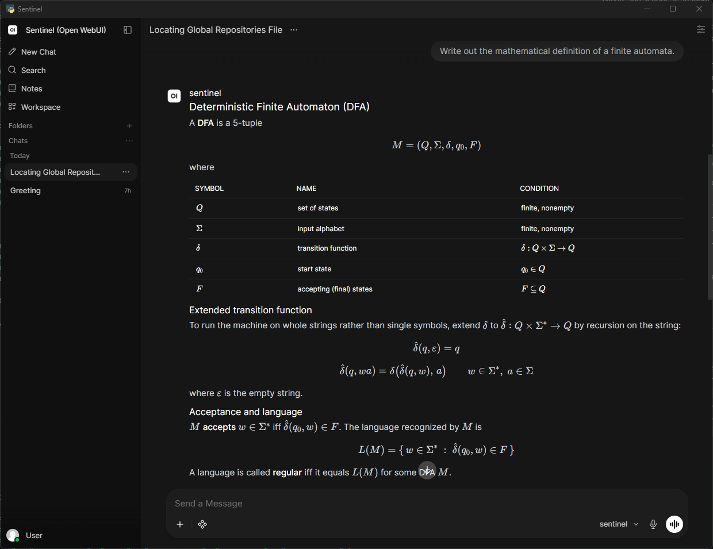

# Sentinel

[](https://www.python.org/)
[](https://fastapi.tiangolo.com/)
[](https://docs.pydantic.dev/)
[](https://www.sqlite.org/)
[](https://docs.anthropic.com/)
[](https://onnxruntime.ai/)
[](https://ollama.com/)
[](https://openwebui.com/)
[](https://core.telegram.org/bots)
[](https://www.twilio.com/)

> **Status** -  In development. ⛏️

A secure, self-evolving personal AI agent with zero external daemons, installed via a single `.exe`.

<p align="center">
  
</p>

Sentinel is an autonomous AI agent that runs as a native Windows desktop application. It wraps the API of any LLM in an OpenAI-compatible API, including both cloud and local models. With optional local LLM fallback in the event that a cloud model become unavailable during operation for any reason. Sentinel offers a branded [**Open WebUI**](https://openwebui.com/) chat interface in a native `pywebview` window. The agent reasons, uses tools, maintains memory, evolves its identity over time, and communicates across multiple channels.

## 📑 Table of Contents

- [✨ Features](#-features)
- [🧩 Architecture](#-architecture)
- [✅ Requirements](#-requirements)
- [🚀 Getting Started](#-getting-started)
- [💻 Development](#-development)
- [🙏 Acknowledgements](#-acknowledgements)
- [📄 License](#-license)

## ✨ Features

| Capability | Description |
|------------|-------------|
| Agentic loop | Trigger → prompt assembly → LLM call → tool dispatch → loop, with hard iteration, loop, and tool timeouts. |
| Three-tier memory | Working, episodic, and semantic memory over SQLite with `sqlite-vec` vector search. |
| Private by default | Embeddings are generated locally on-device — memories are never sent to a third-party service. |
| Identity evolution | The agent's self-description is revised over time from its own accumulated experience. |
| Skill framework | Sandboxed tool and channel skills, each declared by a `skill.json` manifest, with a CLI for scaffolding, validation, and installation. |
| Multi-channel | Chat, email, Telegram, WhatsApp, and phone — all normalised through a single channel router. |
| Voice | Local-first speech-to-text (`faster-whisper`) and text-to-speech (Piper), with cloud fallback. |
| Security | OS-level sandboxing via Job Objects and ACLs, OS keyring credential storage, encryption at rest, and a domain-allowlisted egress proxy. |
| Single-file install | Embedded Python, a PyInstaller launcher, and an Inno Setup installer. No external daemons, no service, no administrator rights. |

## 🧩 Architecture

Sentinel runs entirely in-process or as managed subprocesses — there is no external daemon, message broker, or database server to install. It is a desktop application running in your own user session, not a background Windows service.

| Layer | Technology |
|-------|------------|
| Language | Python 3.12 (async throughout) |
| API gateway | FastAPI + uvicorn, exposing an OpenAI-compatible endpoint |
| Language model | Anthropic Claude API (primary), Ollama (optional local fallback) |
| Embeddings | `all-MiniLM-L6-v2` via ONNX Runtime — local, offline, 384-dimensional |
| Storage | SQLite in WAL mode, `sqlite-vec` for vector search, `diskcache` for caching |
| Interface | [Open WebUI](https://openwebui.com/) in a native `pywebview` window, with a `pystray` system tray |
| Isolation | Windows Job Objects, ACLs, and an egress proxy with a domain allowlist |

## ✅ Requirements

- Windows 10 or 11 (64-bit)
- Python 3.12 (bundled with the installer build; required only for running from source)
- An Anthropic API key
- Optionally, a local [Ollama](https://ollama.com/) installation for offline LLM fallback

No Docker, no WSL, no Node.js, and no system-wide Python installation are required.

## 🚀 Getting Started

```bash
# Install dependencies
pip install -r requirements.txt

# Run the application
python -m sentinel start
```

Credentials are never read from the repository or from configuration files — Sentinel stores them in the operating system keyring on first run.

## 💻 Development

```bash
# Run the automated test suite
pytest -m "automated" --tb=short -q

# Type checking
mypy src/sentinel/ --strict

# Linting
ruff check src/ tests/
```

## 🙏 Acknowledgements

- [**Open WebUI**](https://openwebui.com/) ([GitHub](https://github.com/open-webui/open-webui))
  - Sentinel's chat interface is [Open WebUI](https://openwebui.com/), by Timothy Jaeryang Baek and contributors.
  - Sentinel runs [Open WebUI](https://openwebui.com/) as a managed subprocess inside a native window and points it at the agent.
- LLM APIs
  - [Anthropic](https://docs.anthropic.com/) APIs.
  - [Ollama](https://ollama.com/) model APIs.
- [SQLite](https://www.sqlite.org/)
  - with [`sqlite-vec`](https://github.com/asg017/sqlite-vec)
- [FastAPI](https://fastapi.tiangolo.com/)
- [Pydantic](https://docs.pydantic.dev/)
- [pywebview](https://pywebview.flowrl.com/)


## 📄 License

Released under the [MIT License](LICENSE). Copyright © 2025 Rohin Gosling.

Sentinel bundles no [Open WebUI](https://openwebui.com/) source. It is installed as an ordinary dependency and remains under [its own licence](https://github.com/open-webui/open-webui/blob/main/LICENSE), whose branding terms Sentinel observes.
